## 调度算法

### 最短剩余时间优(抢占式的短作业优先)

1. 思想每当有进程加入就绪队列就需要调度,需要重新评估进程剩余要运行的时间,比如说如果 p_A ,总的要运行7,已经运行了2,此时剩余就是5,然后p_A 在参与 进入比较 [p_A,p_B,...]
2. 计算p1到达，此时队列 [p1:5],p1上处理机p2到达，此时队列 [p1:5,p2:4],p2上处理机p3到达，此时队列 [p1:5,p2:2,p3:1],p3上处理机p3结束，此时队列 [p1:5,p2:2],p2上处理机p4到达，此时队列 [p1:5,p2:1,p4:4],p2上处理机p2结束，此时队列 [p1:5,p4:4],p4上处理机...其过程如图：
   到达时间：p1=0,p2=2,p3=4,p4=5周转时间：p1=16p2=7-2=5p3=1p4=11-5=6**周转_avg** = (16+5+1+6) / 4 = 7带权周转时间:p1=16/7p2=5/4p3=1/1p4=(11-5)/4**带权周转_avg**  = (2.268 + 1.24 + 1 + 1.5)/4 = 1.5等待时间p1 = 9 //因为 0-2 在运行 2-11在等待p2 = 1p3 = 0p4 = 2**等待_avg** = 3
3. 优缺带权周转、等待时间等指标优化 但是 增加了调度次数因此性能可能下降
4. 饥饿会，因为如果是一直短进程进来，长进程就得不到运行
5. 抢占
   抢占

### 时间片轮转(round robin)

1. 思想公平的对待每个进程，每个进程分配固定大小的时间片，时间片的大小会影响性能。 就绪队列里面的进程按照 FCFS 的规则上处理机
2. 计算只有当处理机主动放弃(异常或者结束等)或者时间片结束才进行调度。把就绪队列里面的进程出列，上处理机

   **如果同一时刻既有一个进程下处理机，又有一个新的进程进来，一般默认新的进程先进入队列**

   

   - // 时间片为2
   - 0: p1到达，上处理机
   - 2: p1时间片结束, 下处理机, 同时p2 到达, p2先进队列, 此时 队列为 [p2, p1]  p2上处理机
   - 4: p2时间片结束, 下处理机, 同时p3 到达, p3先进队列 此时队列为 [p1, p3, p2] p1 上处理机
   - 5: p4到达，此时队列为 [p3, p2, p4]
   - 6: p1时间片结束, 下处理机, 插入队尾 此时队列为 [p3, p2, p4, p1] p3上处理机
   - ...
   - 最后的进程运结果如图：
   - 
   - 如果时间片过大的时候RR退化成***FCFS*** // 这里为5
   - 
   - **!因为时间片轮转对长进程和短进程都是一样的，所以一般不研究这种策略下的周转时间和等待时间等**
3. 优缺
   缺点，没有进程优先级的考虑，对于紧急的进程不能优先处理。优点，实现简单，公平,响应快，适用于分时操作系统。关于时间片的大小，不同系统的时间片大小不同，甚至可以动态修改。因为切换有开销，所以时间片的大小太小的话会频繁切换导致实际运行的时间减少，从而降低性能。**一般来说 切换的开销要小于时间片的 1%**
4. 饥饿
   不会
5. 抢占
   不抢占

### 优先级调度算法

1. 思想
   随着计算机的发展，越来越多对优先级有要求的场景出现。每个进程都有自己的优先级，调度的时参考优先级，优先级高的先上处理机一般来说:系统进程的优先级最高然后是需要与用户交互的进程(前台进程)次高然后才是一些例如：AI模型训练等等 的进程操作系统更喜欢 I/O型进程（与之对应的另一种类型叫做 CPU繁忙型）这是因为 I/O 设备可以和CPU 并行工作(数据写到cache里面，控制传输到io设备的buffer里面，就可以离开了)，从而提高系统的吞吐率根据优先级是否可以动态改变分为 **静态优先级** 和 **动态优先级** , 动态的，给进程一个初始的优先级，然后如果进程长时间没有被调度可以适当提高其优先级
2. 计算抢占式每当有新进程进入就绪队列，或者运行态的进程下处理机就进行调度优先数 最高 或 最低(看协定) 的上处理机

   

   
3. 抢占
   抢占、非抢占俩种版本都有
4. 场景
   进程、I/O调度、作业调度
5. 饥饿
   会
6. 优缺
   优点，可以区分优先级适用于实时操作系统。
   实时操作系统的特点：

   - 切换开销小，保证进程可以快速上处理机
   - 进程有优先级，高优先级的进程先处理
   - 对时间有严格的要求，比如说，最晚时间，持续时间，响应时间

   实时操作系统的例子： 医疗注射泵

   - 为了维持病人的生命特征，给他定时给药，持续给药而且，紧急情况下，这种进程不能被阻断，具有高优先性

### 多级反馈队列调度算法

1. 思想
   综合，FCFS，SJF，优先级调度，RR的优点设计出的算法

   - 首先设计多个级别的队列，优先级 从高到低， 时间片从小到大
   - 优先服务高级别队列里面的进程，如果高级别队列空了，就服务低一个层级队列里面的进程
   - 进程在处理机上运行完成以后，插入低一级别优先级队列的队尾，如果这个进程很紧急，可以让他插入当前层级的队列的队尾
   - 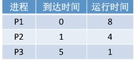
   - 
   - 
   - 
   - 
   - 
2. 场景
   进程调度
3. 抢占
   抢占
4. 优缺
   对各类型的进程相对公平（FCFS），每个新来的进程可以很快被服务（RR），短进程较少的时间就完成了（SPF），**不必预估运行时间避免用户造假**，可以灵活调整对进程的偏好（想要优先IO，就把IO类型进程直接放回原等级队列,而不是下一级的队列）
5. 饥饿
   会

   - 总结
   - 

### 多级队列调度算法

1. 思想设置多个队列，分别处理不同的优先级的进程，时间片按比例分配。 队内的服务策略可以灵活定义(FCFS,SPF,RR)。
   
   时间片划分（50%，40%，10%） 系统进程 500ms  交互式进程 400ms 批处理进程 100ms
   队列里没进程的时候 才会 长时间去 处理 低级别的进程。

## 进程同步、进程互斥

1. 操作系统的基本特征

   - 并发 两个进程宏观上"同时"进行，围观上"轮流"进行 (单处理机)
   - 共享 操作系统里面有限的资源，要被不同的进程使用。有互斥共享和同时共享俩种
   - 虚拟 就是映射，通过虚拟的技术把本来不够用的内存映射到超出大小的虚拟空间，来拓展系统的容量
   - 异步 并发的进程以不可预知的速度同步推进
2. 进程同步就是 并发的两个进程有着相互制约的关系。 pA_code1 必须在 pB_code2 后 执行。 那么pA执行到 pA_code1 的前一步，就必须阻塞，等待 pB_code2 传递结果。阻塞的方式有多种:循环检查, 这种方式不下处理机，浪费了处理机的资源，但是却减少了切换带来的开销
   使用原语，主动放放弃处理机： block(L) 等
   例子: 管道通信

   读进程必须在写进程之后
3. 进程互斥
   就是 计算机里面的共享资源，在同一时刻只能有一个进程访问。
   对于计算机来说，资源的概念是广泛的， 计算机等I/O设备叫做资源， 文件也能叫做资源。 比如说 群控脚本，记录已添加手机号的文件。

   与互斥共享相对应的就是同时共享, 只读文件可以同时给多个人访问，写文件就只能一个人访问（但是现在有那种多人协同共享工作的方式）

   进程互斥的基本逻辑：
   do {
   entry section; // 进入区, 进入区要完成 检查 和 上锁的操作
   critical section; // 临界区, 对临界资源进行访问的区域
   exit section; // 退出区 ， 解锁
   remainder section; //  剩余区
   } while (true)
4. 临界资源
   每一次只允一个进程(或线程)，访问的资源叫做 临界资源。群控脚本，记录已添加手机号的文件，就是一个文件，访问他的是线程(执行脚本实例化的wo ker)
5. 访问临界资源的基本原则

- 空闲让进 // 就是并发的进程，一定有一个能进临界区。说如果有空闲的处理机，一定可以上去。 比如说，你的临界区代码，如果执行的时候发生了异常，没有进行解锁的操作，直接退出了，其他进程就不能上处理机。
- 忙则等待  // 上锁和检查的操作，不原子的化的时候就会出现这个问题。

  ```python
  while (xObj.editor.count == 0 ) { // 检查 code1
   xObj.editor.count = 1 // 上锁 code2
   ...
  }
  ```

  xObj.editor.count 是 这段代码试图通过 这俩句话来完成对临界资源的互斥访问。但是由于  "检查和上锁" 不是 原子化的，因此  会发生：pA_code1 执行完成后 切换到 pB，pB执行code1，也进入的临界区, 因此违反了 忙则等待的原则。
- 有限等待 //  比如说，群控微信，每个微信号要求添加 20个微信， 如果你没有做好限制，有的进程就一直拿不到资源，一次也没有执行。  而其他进程可能执行很多，他数量上兵不是一样的。  如果你的代码不能保证每个进程都被服务，就违反了 有限等待的原则。  解决方案： 设置次数限制， 超过次数的停止。（应该不对）
- 让权等待 //  意思就是说， 没有进入过临界区的进程，他会一直循环等待，循环的时候是占用处理机的。 如果你的电脑是单处理机的电脑，就会严重影响性能。 多处理机也是，会占满一个时间片才被释放
- 空闲让进、忙则等待、有限等待、让权等待

## 进程互斥的软件实现方式

如果没有进互斥会发生什么？   群控脚本写数据的时候，如果不互斥，可能出现手机号混成一团。 文件清空。
为什么文件会被清空？
如果 文件没有被正常关闭，他可能数据还在buffer里面没有写进去。
如果用的是 "w" mode 那么可能 worker_a 刚 flush 文件了 worker_b 就关闭了文件导致清空
如果用的是 "a" mode 可能丢失的是后面的本身。 但是因为 python 提供的close 方法是 安全的，所以正常不会出现文件损坏。

### 错误案例

#### 单标志法


思想： turn 为1 的时候给 p1 使用， 为0 的时候给p0 使用；
错误： 假设turn为0，P0 运行 进入临界区，而p0 一直不上处理机（因为p1在循环检查）
违反： 空闲让进

### 双标志先检查


思想：flag 来表示 当前 进程 占用处理机的情况。 flag[1] == true 说明 p1 在用处理机, p0 就不进去临界区
错误：如果 code1 刚判断完可以上处理机，就发生了进程切换，执行 code5 那么此时 flag[0] 还是false, 因此可以上处理机，结果违反了 忙则等待。 会出现这种情况是因为 检查和上锁没有一气呵成（原子化）
违反：忙则等待

### 双标志后检查

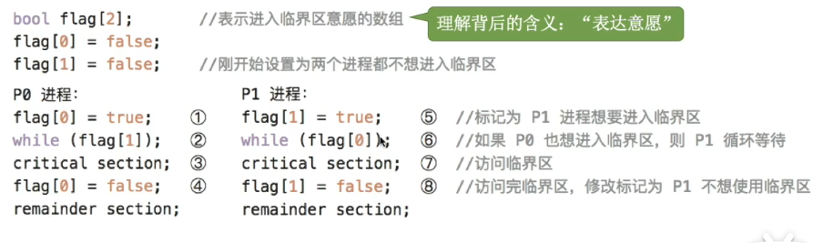

思想： 先告诉你我要用，然后看你要不要用，你不用我就用了。 因为进临界区的只可能发生在对方使用完临界区之后。而在这之前已经告知对方我要进临界区了，从而对方不可能又再一次进了临界区
错误：  违反了空闲让进和有限等待。 因为如果 code1 执行以后，切换了进程，执行code5。 那么p0、p1都无限循环，因此违反了空闲让进和有限等待。
违反：  空闲让进、有限等待

### peterson 算法


思想： flag[] 表示意愿。 turn 表示 谁能进。 p0 里面 turn=1 表示对方能进。这个时候如果对方刚好是想进的 flag[1] = true, 他就进临界区了。 直到 他的flag设置为false。

错误： 如果代码执行到7的时候，突然切回p0，那么 turn=1 且 flag[1]=true， p0就会卡在3，循环到时间片结束，因此违反让权等待（当进程无法立即进入临界区，就立马下处理机）

违反: 让权等待

**思考： peterson 算法里面。有没有可能A和B中，A一直占用处理机，且A进不去（停留在代码3）。这是否违反了有限等待？**

查询chatGPT得知，这取决于 调度算法是否允许抢占(preemption)。且如果一个进程一直停留在循环不会进展，这就浪费了计算机的资源。这是系统的 **调度算法 有问题**，需要重新设计。 因此 思考的时候不需要考虑这种情况。
**因此不要害怕永远不切换。不需要考虑这种情况**


## 进程互斥的硬件实现方式

### 关中断方式

当一个进程进入临界区的时候 ，直接关中断，然后，其他进程无法响应。就实现了互斥。


问题：
    1. 首先由于 进程切换需要 利用 trap 指令 来把 用户级线程切换到内核级线程。而trap 指令是通过中断实现的。 所以**中断的时候 无法切换进程**

    **普通的程序员无法主动创建内核级线程**
    **trap 指令 执行的时候 会 首先 把要进行的系统调用类型 记录到 某个reg，同时保存现场 **

    2. 其次由于  多处理机，他的中断服务都是针对单处理机的，所以，锁了一个处理机，别的处理机还能上去，因此不能实现互斥访问

### TestAndSet 指令

TSL 指令的 逻辑等效代码：


while(TestAndSet(&lock)) 只有当lock是 false 的时候才放行。
如果 lock 已经 改为 true 说明有进程进入临界区了。
这个时候别的进程，调用TSL指令，得到的是 true， 从而阻塞。

**最关键的地方是TSL(TestAndSet指令的等效代码)是原子化的**

缺点： 不满足让权等待

### Swap 指令 (XCHG指令)

Swap 指令的逻辑等效 代码：


1. 进入的时候 检查 old, 执行 swap，如果 lock 是 false 的话（说明临界区空出来的），swap一下，old变成 false，就可以进临界区了。
2. swap 指令是原子化的。
3. 并发执行的进程 old 一进来 是 true， old是一个局部变量。 lock 是一个全局变量。也就是说 只有一个进程在 swap 之后 old 变为false，能进入 临界区 。

## 互斥锁 (mutex lock)

互斥锁, 互斥锁能够, 实现多处理机的上锁，且使用方便简单。 **问题是不满足 让权等待**
**不满足让权等待的锁又叫做自旋锁。因为他在哪里无限循环直到时间结束**

**自旋锁的策略一般适用于多处理机**，因为进程切换是有代价的。而自旋锁自旋的特性使得他在别的处理机的兄弟，可以立刻上锁，进入临界区。所以代价实际上很小。

单处理机的自旋就比较影响性能了。


```python
lock = Rlock()
with lock:
  ...
```

python 那个群控项目的锁也是互斥锁。

### python lock 和 c++ lock 的区别

python 有个 GIL (global interpreter lock), GIL 使得 python 的 多线程 实际上映射内存里面 只有 1个 内核级 线程。

而 c++ 的多线程使用了 线程库 封装好的库函数。 是真正的多线程，可以映射到 多个内核级 线程。

**为什么python要使用GIL ?**

1. 使得 Cpython 的拓展更加容易
2. 简化了内存管理的工作，
3. 避免一些用户错误使用导致的 内存泄露 和 一些内存相关的问题 （提高安全性）

**有办法解开GIL吗?**
python 没有提供解开GIL的东西，并且不打算解开。 但是我们可以用多进程(multiprocessing) 来替代

**Cpython 和 python的区别**
python 是语言， Cpython 是 解释器，除了Cpython 还有 jython,Pypy 等等

**什么语言是C写的，什么不是？**
Python,Ruby,PHP,Perl,Lua,SQlite,GCC 是C写的。
Java,C#,Javascript,GO,Swift 不是C写的，但是他们的库可能是C写的

**如何使用C++来编译python的library? 如何把C++和python结合起来**其实主要是C++这边的工作。 使用 C++ 写一堆东西，然后进行编译，就可以被python导入使用了。

1. 写C++library

```cpp
// example.cpp
#include <iostream>
void greet(const char* name) {
  std::cout << "Hello, " << name << "!" << std::endl;
}
```

2. 写python拓展模块

```cpp
// example_module.cpp
#include <Python.h>

// Wrapper function for the greet function
static PyObject* py_greet(PyObject* self, PyObject* args) {
    const char* name;
    if (!PyArg_ParseTuple(args, "s", &name)) {
        return NULL;
    }
    greet(name);  // Call the C++ function
    Py_RETURN_NONE;
}

// Method definitions
static PyMethodDef methods[] = {
    {"greet", py_greet, METH_VARARGS, "Greet the given name"},
    {NULL, NULL, 0, NULL}  // Sentinel
};

// Module initialization function
static struct PyModuleDef module = {
    PyModuleDef_HEAD_INIT,
    "example",   // Module name
    NULL,        // Documentation string
    -1,          // Size of per-interpreter state of the module, or -1 if the module keeps state in global variables.
    methods
};

// Module initialization macro
PyMODINIT_FUNC PyInit_example(void) {
    return PyModule_Create(&module);
}
```

3. 编译

```bash
# Compile the C++ code into a shared library
g++ -o example.so -shared -fPIC example.cpp example_module.cpp -I /path/to/python/include -L /path/to/python/libs -lpythonX.Y
# Use the extension module in Python
```

4. 使用

```python
# test.py
import example

example.greet("world")  # Should print "Hello, world!"
```

**是不是只有预编译的语言能作为库？ 解释性的语音不行？**
通常来说是的，但是也有一些例外

## 信号量机制

由 Dijkistra 发明的机制。利用操作系统提供的一对 原语 来实现 对 信号量 的操作

**信号量的含义是 计算机里面的某种资源**

wait() 和 signal() 原语, 又称为P操作和V操作。 P操作记录系统资源减一， V操作记录系统资源+1

### 整形信号量


wait signal 是一堆原语。 wait 会检查系统中资源的数量，有资源的话数量-1。 signal 会把数量+1 。 **违反让权等待**
但是这个地方不太严谨，因为如果wait是原语，那么他执行的时候是管中断的，那么while检查就不会下处理机。

### 记录型信号量

他是一个数据结构，既然是数据结构，就可以定义的更加丰富。 最基础的要有：资源的数量，指向等待队列的指针（排队的是等待被服务的进程）


注意看清楚： wait 和 signal 是一对原语。  block 和 wakeup 是一对原语。

semaphore // 信号量

P操作让资源的数量-1，然后，如果系统中无可供使用的资源(if (S.value < 0))，就主动阻塞 block(S.L)  把当前阻塞的进程 挂载到 S的等待队列里面。


## 使用信号量进行进程同步、进程互斥

使用信号量的基本准则：

1. 不同的资源使用不同的信号量
2. V、P 操作必须成对的出现，如没有P就没办法保证 对进程的互斥访问。 没有P操作可能就永远不唤醒。
   

实现互斥的方式： 在临界区前 P，在结束时V。

### 进程同步


实现进程同步的方式： 前V，P后 // 前指的是必须在前面执行的代码，后面紧跟V操作， P后指的是 后代码的前面必须是 P操作
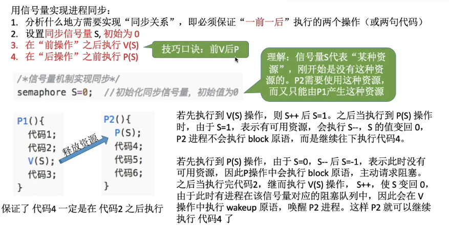

**使用信号量来实现前驱关系**

把每一对需要同步的信号量都列出，然后用前VP后的原则来写代码。


## 经典的进程 互斥和进程同步的 模型

### 生产者和消费者问题

**问题描述**
系统里面有一组生产者进，一组消费者进程，一个缓冲区（大小有限）。 当缓冲区不满的时候生产者才写数据进去，当缓冲区不空的时候消费者才能取数据。 缓冲区是临界资源，各个进程只能互斥访问。  （因为写进程如果同时在缓冲区操作同一片数据，就错误，如果消费者进程同时拿走数据也会错误）


**关系分析**
关系分析就是进程之间的制约关系。 资源是什么？ 前V后P 他们是关于哪种资源有制约关系？
这个模型里面，有这样的关系：
缓冲区没满->生产者进程
缓冲区没空->消费者进程
前V后P，操作的资源是什么？  缓冲区， 前V后P 的代码分别在哪里？
生产者V，消费者P (V钱，去P)
**前V后P，是在进程同步模型里面，生产者V，消费者P，而不是在进程代码里面 前V后P**

在这个模型里面，生产者和消费者是进程，所以，他们有代码：

Producer(){
}
Consumer(){
}

资源是 缓冲区:
sephamore number = 0
因为要监控 满和空 两种状态  所以：这样实现起来比较方便
sephamore empty = 0
sephamore full = n

用伪代码写出，生产者和消费者进程。

```javascript
Producer(){
  while(1){
    生产一个产品；

    把产品放进缓冲区；
  }
}  
```

```javascript
Consumer(){  
  while(1){
  从缓冲区取出产品；

  使用产品；  
  }
}  
```

然后把资源放进去：

```js
sephamore full = n; // 这种 资源 一开始 有 n 个   
生产者要把 产品放进缓冲区，要求 "full" 这种资源 大于0 否则，他就满了，因此  

缓冲区没满->生产者进程  

full 是缓冲区的一种资源， 生产者是要申请这种资源   
P是消费资源，V是增加资源 

P(full) (后P) 表示 申请一个 full 资源。

他对应的V在哪？ 在消费者进程里面产生, V(full) 在消费者里面

Producer(){
  while(1){
    生产一个产品；
    P(full) // 消耗一个full资源
  

    把产品放进缓冲区；
  }
}  

Consumer(){  
  while(1){
  从缓冲区取出产品；
  V(full) // 产生一个full资源

  使用产品；  
  }
}  
```


```c++
缓冲区没空->消费者进程  
消费者 P(empty) 表示  消费一个empty 资源 ，对应 V(empty) 表示 产生一个 empty 资源(在生产者里面)， 当empty < 0 消费者就阻塞的。

empty 可以理解为缓冲区产品的数量。  full可以理解为 缓冲区 空位的数量。 

所以: 
Producer(){
  while(1){
    生产一个产品； // 生产完产品才会有消耗 full的需求
    P(full) // 消耗一个full资源
  
    V(empty) // 产生一个empty资源
    把产品放进缓冲区；
  }
}  
Consumer(){  
  while(1){
  P(empty) // 消耗一个empty资源, 有empty才能从缓冲区 取出
  从缓冲区取出产品； // 取出产品以后才会产生full资源

  V(full) // 产生一个full资源
  使用产品；  
  }
}  
再把对临界区的访问上锁，
saphamore mutex = 1; // mutex默认为1,因为可以把它当成一种资源。然后资源都是 往下减的。 减到 0 阻塞
 
Producer(){
  while(1){
    生产一个产品；
    P(full) // 消耗一个full资源
    P(mutex)
    critical section
    V(mutex)
    V(empty) // 产生一个empty资源
    把产品放进缓冲区；
  }
}  
Consumer(){  
  while(1){
  P(empty) // 消耗一个empty资源, 有empty才能从缓冲区 取出
  从缓冲区取出产品； // 取出产品以后才会产生full资源
  P(mutex)
  critical section // 操作缓冲区
  V(mutex)
  V(full) // 产生一个full资源
  使用产品；  
  }
}  
```

**P操作能交换顺序吗？ V操作能交换顺序吗？**

假设:

```c++
Producer(){
  while(1){
    生产一个产品；
    P(mutex) // 换位
    P(full) 
    critical section
    V(mutex)
    V(empty) 
    把产品放进缓冲区；
  }
}  
```

此时有个 生产者进来 ，P(mutex) 通过，而 P(full) 由于资源的数量 不够阻塞了。 消费者着还没执行到V(full)释放资源。  这时 如果 再进来一个 生产者 。 由于 mutex 没有释放，所以阻塞。 从而死锁。

**因此P操作不能更换顺序**
**V操作可以换位，因为他不会 使用block(S.L) 来触发阻塞**

**如何分析一个模型的进程同步、互斥关系?**

1. 画出 前P，后V关系图，找到制约关系
2. 写出进程逻辑的伪代码（ 死循环 + 执行的操作,例如产生一个产品 ）
3. 把PV关系和  执行的操作  分析清楚放到对应的位置


### 多生产者和多消费者问题

问题描述：  缓冲区有一个(大小有限)，生产者有多个，各自产出不同的产品，消费者有多个，各自消费不同的产品


资源是什么？

1. 缓冲区
2. 产品1
3. 产品2

PV 关系？

1. 生产者1->消费者1 (产品1)
2. 生产者2->消费者2 (产品2)
3. 生产者1,2 -> 消费者1,2 (缓冲区)

因此：

```c++
// 等号右边是跑起来的时候的初值, 表示资源的数量
sephamore apple = 0;  
sephamore orange = 0;
sephamore plate = 1; 
sephamore mutex = 1; // 互斥访问缓冲区
```

生产者和消费者的代码主体?

```c++
Producer_Father() {
  while(1) {
    生产一个苹果；

    把产品放到缓冲区；
  }
}

Producer_Mother() {
  while(1) {
    生产一个橘子；

    把产品放到缓冲区；
  }
}

Consumer_Son() {
  while(1) {
    从缓冲区取走苹果；

    吃掉苹果;
  }
}

Consumer_Daughter() {
  while(1) {
    从缓冲区取走橘子；

    吃掉橘子;
  }
}
```

把代码主体和PV关系结合：

1. 生产者1->消费者1 (产品1)
2. 生产者2->消费者2 (产品2)
3. 生产者1,2 <- 消费者1,2 (缓冲区, 消费者产出缓冲区给生产者使用)
   

爸爸产生 apple 资源 V(apple), 消耗一个 缓冲区资源 P(plate), 当生产者把 资源放到缓冲区的时候

前V后P,生产者V，消费者P。

```c++
Producer_Father() {
  while(1) {
    生产一个苹果；
    P(plate); // 为什么 P(plate) 要在 把产品放到缓冲区； 前面？ 因为 肯定要先申请 缓冲区的空位 才能使用 啊
    把产品放到缓冲区； 
    V(apple); // 为什么V(apple) 在 缓冲区后面？ 因为只有操作完了缓冲区，才能说产生了一个苹果。如果放在缓冲区前面，
  }
}
妈妈: 产生orange资源，消耗plate资源
Producer_Mother() {
  while(1) {
    生产一个橘子；
    P(plate);
    把产品放到缓冲区；
    V(orange);
  }
}
儿子： 消费apple资源，产生plate资源
Consumer_Son() {
  while(1) {
    P(apple); // 申请拿走一个苹果，把申请和产生带上你就理解关系了。
    从缓冲区取走苹果；
    V(plate); 
    吃掉苹果;
  }
}
Consumer_Daughter() {
  while(1) {
    P(orange); // 申请拿走橘子
    从缓冲区取走橘子；
    V(plate); // 产生盘子
    吃掉橘子;
  }
}
```

对缓冲区的操作上锁：

```c++
Producer_Mother() {
  while(1) {
    生产一个橘子；
    P(plate);
    P(mutex);
    把产品放到缓冲区；
    V(mutex);
    V(orange);
  }
}
```

运行过程模拟：

- 父亲申请一个盘子，被许可。
- 此时母亲过来，因为没有 盘子资源，被阻塞
- 此时女儿过来，因为没有 橘子资源，被阻塞
- 此时儿子过来，因为没有 苹果资源，被阻塞
- 此时父亲把苹果放到盘子里了，让后 V唤醒了 儿子。
- 儿子取走苹果，盘子空出。
- 此时母亲被唤醒，使用盘子
- ....

**这个例子为什么不需要要对临界资源上锁？**

因为 plate 这个变量 初值为1。 所以生产者不可能同时进入临界区。 又因为，只有当临界区使用完才 V(orange)/V(apple)。 所以消费者不可能同时进入临界区。 又因为消费者才能V(plate)，所以只有可能消费者使用完临界区才能

**那什么时候需上锁？**
假如临界区的资源 不止一个就要上锁了。因为，如果 plate = 3 那么父亲和母亲进程 就可以同时进入临界区，就会出操作临界区上的问题

**最核心的点是理清楚负责的同步关系，缓冲区不是复数的，所以爸爸，和妈妈不是交叉形成互斥关系的**

### 吸烟者问题

问题描述：
总共有三种资源。三个消费者各自需要两种不同的资源。生产者**轮流**提供这些资源(提供组合，一个组合有俩种资源)。等待消费者取走使用


资源分析:

1. 大小为1的缓冲区
2. 组合1，组合2，组合3。
   为什么不是 物件1、物件2、物件3？ 因为资源数量相同，你拆开的话，进程同步关系却复杂化了。

VP关分析：

生产者生产组合1->消费者消费组合1 // offer1
生产者生产组合2->消费者消费组合2 // offer2
生产者生产组合3->消费者消费组合3 // offer3

缓冲区大小为一，说明不需要特地去给他上锁

关键的轮流要怎么实现？？？
轮流其实意味着消费者对与 生产者也有一个制约的关系。  必须要等消费者告诉你消费完了，你才能去进行下一步。

否则的话生产者就是一直循环P三种资源了。


消费者->生产者 // finish
必须消费者消费完了他才生产。

生产者轮流为他们服务，而消费者消费完生产者才能继续进行所以：

```c++
semaphore finish = 1; // 用来告诉生产者他消费完了
semaphore offer1 = 0;
semaphore offer2 = 0;
semaphore offer3 = 0;

Producer(){
  int i = 0;
  int remainder = 0;
  while(1) {
    i++;
    remainder = i%3;
    switch(remainer) {
      case 0:
        P(finish);
        把产品放到缓冲区;
        V(offer1)
      break;
      case 1:
        P(finish);
        把产品放到缓冲区;
        V(offer2)
      break;
      case 2:
        P(finish);
        把产品放到缓冲区;
        V(offer3)
      break;
      default:
      break;
    }
  }
}
消费者
Comsumer1(){
  P(offer1);
  把产品从缓冲区拿走；
  使用产品； // 使用完产品产出一个finish
  V(finish);
}
...
```

### 读者写者问题

问题描述： 读，写两种进程同时进行。 临界资源是文件。只有 读进程和读进程 才能同时访问 文件，而 写-读，写-写，读-写都不允许。缓冲区大小大于1

VP关系分析:
读->写
写->写
写->读

那就想办法让 读、读可以同时进来。 弄一个 reader_count 只有reader_count == 0 时，写进程才能进来。 然后还要有个文件锁。

```c++
int reader_count = 0;
sephamore rw = 1;  // 文件锁
sephamore mutex = 1;  // 检查锁


读
Reader(){
  // if(reader_count == 0) {
  //   P(rw)
  // }  不是一气呵成的，需要上锁 
  P(mutex)
  if(reader_count == 0) {
    P(rw)
  } // 不是一气呵成的，需要上锁 
  reader_count ++; // count 数量也需要互斥的修改，否则就会出现数量异常从而导致失败的情况
  V(mutex)
  读取文件;
  P(mutex)
  reader_count --;
  if(reader_count=0) {
    V(rw)
  }
  V(mutex)
}
写
Writer(){
  P(rw);
  写文件；
  V(rw);
}
```

这种写法可能出现 "写进程饿死" 的情况。因为如果源源不断有读进程进来，reader_count 永远大于0 导致写进程进不来。

**如何解决写进程饿死的问题?**

```c++
int reader_count = 0;
sephamore rw = 1;  // 文件锁
sephamore mutex = 1;  // 检查锁
sephamore w = 1; // 写进程防饿死

读
Reader(){
  """第一段"""
  P(w) // 改动
  P(mutex)
  if(reader_count == 0) {
    P(rw)
  }  
  reader_count ++; 
  V(mutex)
  V(w) // 改动


  """第二段"""
  读取文件;
  P(mutex)
  reader_count --;
  if(reader_count=0) {
    V(rw)
  }
  V(mutex)
}
写
Writer(){
  P(w) // 改动
  P(rw);
  写文件；
  V(rw);
  V(w) // 改动
}
```

运行情况分析：

1. 读->读  读进来P(w)锁住,此时别的读进程无法进入第一段。读继续运行 此时别的读进程可以进来，增加reader_count 从而可以实现多读者同时访问。
2. 写->写 因为 资源w只有一个，所以 P(w)V(w)直接实现写者的互斥访问
3. 写->读 P(W)锁住，所以读进程可以互斥访问
4. 读->写->读  读1进来，写进来，读2进来。 w的等待队列 写->读2；
   然后读1访问完 第一段。释放w，此时 写获取w。 w的等待队列 读2;
   然后由于 读1还没有 释放 rw,  写堵塞在rw。rw的等待队列 写;
   然后由于 读1V(rw)，释放以后，写开始访问临界区。;
   然后写V(w),释放w以后，读2才访问临界区;

所以这样就实现了"写优限", 实际上是按照 fcfs的 原则服务读写 进程。

**为什么？**
因为rw这个资源 由于 reader_count 的存在变得不平等了。 而w的获取和释放没有和什么条件挂钩，因此是平等的。

**注意：reader_count的检查，和改变是需要上锁的，这种全局变量的改变，都要上锁，记住了。**

### 我的项目代码解析

```python
def lock_file(func):
    def wrapper(*args, **kwargs):
        writeFlag = False
        lock = RLock()  # 上锁
        while (not writeFlag):
            printMsg("正在获取锁")
            if (xObj.script.EditorCount == 0):
                with lock:
                    xObj.script.EditorCount = 1
                    printMsg("成功上锁")
                    try:
                        result = func(*args, **kwargs)
                    except Exception as e:
                        logMsg("{}: {}, args: {}, kwargs: {}, ".format(e, func.__name__, args, kwargs))
                        raise
                    finally:
                        xObj.script.EditorCount = 0
                        writeFlag = True
                        printMsg("解锁")
            xObj.Sleep(1500)
        return result
    return wrapper
```

这里使用的是RLock() 互斥锁的一种。 互斥锁的原理是：


互斥锁本身已经实现了对临界区的互斥访。所以

```python
            if (xObj.script.EditorCount == 0):
```

**有必要吗？**

没必要，这个操作是多余的，除非说你这个资源拿来记录一些信息，比如说总共需要跑多少个，然后完成的数量。

**这个侠客启动的worker到底是线程还是进程?**


在系统管理器里看到的这个其实是进程不是线程。
srchost.exe 看到数量这么多，就以为是 侠客产生的进程。实际上他是系统产生的服务，系统的进程。

**任务管理器不提供线程级别的数据**

最后一项是UAC虚拟化

这个才是侠客的进程，这些worker都是线程。

**如果你的worker使用的是subprocess，不是threading，就得使用 multiprocessing 里面的lock。 而不是multithreading 里面的lock。**

**什么是UAC虚拟化?**
当用户需要触碰到一些核心模块的时候，UAC就虚拟一个地方出来给用户使用，这样可以保护操作系统不受影响。观察 task manager 的 detail tab发现 只有： system(4) system idle process(0) system interrupts 才有 UAC虚拟化。其他进程不是 not allow 就是 disabled。
什么进程可以 UAC 虚拟化？

- legacy process 以前的进程。
- 要改动到系统的关键区域的进程等等

### 哲学家进餐问题

这是由Dijkstra提出的思想问题，通过对这个问题的解决，可以想明白系统中的共享资源要怎么分配比较合理。

**要学习预防死锁问题的思路**

每个哲学家必须要俩个筷子才能吃饭。筷子分别在左右手。哲学家围坐在桌子旁形成环状的结构。


错误一：


首先，想要实现"环状"的结构。 就构造一个数组，然后mod数组长度。
第二，用chopsticks来表示 环状的资源。
这个代码的错误在于： 如果所有进程同时拿起他左边的筷子就死锁了。

**关于死锁的解法**

解法一：限制总数
同一时间最多只允许4个人拿起筷子。这样可以保证至少一个哲学家可以同时拿起俩个筷子。

解法二：寄偶区分
要求奇数编号的哲学家先拿左手的筷为，偶数编号的哲学家先拿右手的筷子。这样奇偶都会因为奇数编号的资源而阻塞，从而不会环状阻塞，从而不会死锁。

解法三：全取才进
只有当一个哲学家，左右手都有筷子的时候才能进入临界区。
实现方式：

这个mutex保证了哲学家拿筷子是互斥的。有可能某个哲学家，拿起一个筷子，也进了临界区。但是于此同时，其他哲学家必然是拥有俩筷子的，所以不可能会阻塞。

解法四：服务生
为了演示这种解法，假设哲学家依次标号为A至E。如果A和C在吃东西，则有四支餐叉在使用中。B坐在A和C之间，所以两支餐叉都无法使用，而D和E之间有一只空余的餐叉。假设这时D想要吃东西。如果他拿起了第五支餐叉，就有可能发生死锁。相反，如果他征求服务生同意，服务生会让他等待。这样，我们就能保证下次当两把餐叉空余出来时，一定有一位哲学家可以成功的得到一对餐叉，从而避免了死锁。

解法五：资源分级
把资源按照一定顺序分级， 1-5。 只能取更高级的资源。比如说取了3 就只能取 4 或5。 一个工作单元（哲学家）总是先拿起左右两边编号较低的餐叉，再拿编号较高的。用完餐叉后，他总是先放下编号较高的餐叉，再放下编号较低的。在这种情况下，当四位哲学家同时拿起他们手边编号较低的餐叉时，只有编号最高的餐叉留在桌上，从而第五位哲学家就不能使用任何一支餐叉了。而且，只有一位哲学家能使用最高编号的餐叉，所以他能使用两支餐叉用餐。当他吃完后，他会先放下编号最高的餐叉，再放下编号较低的餐叉，从而让另一位哲学家拿起后边的这只开始吃东西。
但是这种方式对获取的资源有顺序要求，而实际的进程可能不遵循他的顺序，从而导致浪费性能。

解法六：脏筷子法1984年，曼尼·钱迪和贾亚达夫·米斯拉提出了哲学家就餐问题的另一个解法，允许任意的用户（编号
争用任意数量的资源。与资源分级解法不同的是，这里编号可以是任意的。

- 对每一对竞争一个资源的哲学家，新拿一个餐叉，给编号较低的哲学家。每只餐叉都是“干净的”或者“脏的”。最初，所有的餐叉都是脏的。
- 当一位哲学家要使用资源（也就是要吃东西）时，他必须从与他竞争的邻居那里得到。对每只他当前没有的餐叉，他都发送一个请求。
- 当拥有餐叉的哲学家收到请求时，如果餐叉是干净的，那么他继续留着，否则就擦干净并交出餐叉。
- 当某个哲学家吃东西后，他的餐叉就变脏了。如果另一个哲学家之前请求过其中的餐叉，那他就擦干净并交出餐叉。

这个解法允许很大的并行性，适用于任意大的问题。


餐叉什么时候是干净的？  只有，从别人手里抢过来的时候才是干净的。这个时候干净的叉子不让给别人。 必须要两个手的叉子都是干净的才能吃。

假设所有人都拿起了左手的餐叉。 有没有可能全是干净的，从而死锁？
不可能。 假如A拿起俩脏筷子，B找A要，C找B要，到E的时候，B到E有一个干净，E再从A要，A就给他。然后就可以逆推了，不会死锁。

## 死锁

### 概念

在并发环境下，各进程因为争抢资源而造成的一种**互相等待对方手里的资源，导致进程都阻塞，无法向前推进的现象**。死锁发生以后如果没有外力干涉，各进程都无法向前推进。

死锁、饥饿、死循环差别：
死锁： 互相等待对方资源，导致无法推进。
饥饿： 一直得不到索要的资源，导致无法推进。
死循环： 执行的过程一直跳不出某个循环，有时候是故意为之，有时候是代码错误。


### 死锁产生的必要条件

1. 互斥条件 //  互斥使用的资源才会导致死锁。(打印机，互斥资源，扬声器非互斥资源)
2. 不剥夺条件 //  进程资源使用完之前不被其他进程强行夺走。
3. 请求和保持条件 //  已经拿走了一个资源，拿在手里。又请求另外的资源。  比如说: 1: P(rw)P(g) 2: P(g)P(rw) 如果  1拿走rw，在请求g，2拿走g，再请求rw。就阻塞了。
4. 循环等待链 // 就是请求的资源，他会形成循环的结构，就跟哲学家进餐问题一样。 **死锁是循环等待的必要条件,循环等待未必死锁**  当循环等待的时候如果有个额外的资源进来，就不死锁了。

同类资源数量如果大于1，即使有循环等待可能也不死锁。


### 什么时候会死锁？

1. 对系统资源的竞争不可剥夺.
2. 错误使用信号量。//  P(mutex)P(r)critical section
3. 进程推进顺序非法。 //  1: P(rw)P(g) 2: P(g)P(rw)

### 死锁处理策略

1. 预防死锁： 破坏四个条件中的一个
2. 避免死锁： 银行家算法
3. 检车和解除： 允许死锁发生，但是要有检测和解除的机制


### 死锁的预防策略

1. 破坏互斥条件：比如使用SPOOLing技术把本来需要互斥访问的资源，改造成逻辑上可以同时访问。
   
2. 破坏不剥夺条件：
   在进程使用完资源之前，如果有新的进程进来，就把他资源拿走。
   比如在进程调度算法里面的剥夺算法。

有俩种破坏方式：

- 假如某个进程请求的资源得不到满足，就必须立即释放当前手里保持的资源。
- 借助操作系统的帮助，看某个资源给不给强行剥夺，这个方式一般要考虑优先级。

破坏剥夺方式的缺点：

- 实现较为复杂（因为要考虑保存和恢复）
- 可能导致一些已经完成的工作失效，所以只有那种易保存和易恢复的资源才可以使用，比如CPU
- 反复申请和释放增加系统开销，降低吞吐量。
- 有可能导致饥饿。

3. 破坏请求和保持条件
   可以采用**静态分配方式**。 即进程在运行前先申请完他所有需要的资源，否则不能投入运行。

- 实现简单
- 如果申请的资源需要很长时间，那么他已经拿到的资源也一直被保持，导致资源的利用率低。
- 可能会导致饥饿
  

4. 破坏循环等待条件
   可以采用顺序资源分配法。就是给资源编号，他索要的所有资源，只能按从小到大的顺序索取。


- 不方便添加新设备
- 进程实际使用资源的顺序和申请的顺序不一样，导致资源的浪费。 比如说P3 申请的5号资源是 打印机， 7号是扫描仪。  他申请了打印机，但是扫描仪正在被使用，导致他等待了很久，直到拿到扫描仪扫描以后才能使用打印机。 这个期间打印机这个资源就没有得到利用。
- 必须按照规定的次序来申请资源，用户编程麻烦。
- 不同的机器对资源的编号可能是不同的，从而同样的程序在不同的机器，不能正常运行，兼容性差。

**总结**


### 避免死锁，银行家算法

银行家算法是 Dikjstra发明的用来解决银行贷款问题的算法。评估操作系统分配资源的时候，会不会存在风险的问题，和银行贷款问题类似。因此操作系统分配资源的算法也叫银行家算法。

问题描述：
有好几个企业来找银行家借钱，他们的总金额已知，他们的当期金额已知，要评估，如果借出去会不会出现余钱无法给任意一个人分配的情况。


已经借出去60，还剩下40，这时B请求30，如果借给他，他还需要20才能满足，而系统剩下10，满足不了任何人了。


所以不能借给B。
借给A则是安全的。


按照T-B-A的顺序可以满足要求，这个序列叫做安全序列

#### 安全序列

如果系统按照一种序列分配资源,则每个进程都能顺利完成。只要能够找出一个安全序列，系统就处于**安全状态**。 安全序列可能有多个

如果系统找不出一个安全序列，就进入了**不安全状态**。但是如果有一个进程提前归还了资源，系统又可能重新回到安全状态。但是考虑的时候必须是考虑最差情况

因此在分配资源之前，**预估此次分配会不会使系统进入不安全状态，这个就是银行家算法的核心**

求安全序列


先把系统中资源总数列出，然后把当前资源分配情况列表。 还需分配=总需求-已经分配。 剩余资源-还需分配，如果大于1，就可以把他添加到安全序列里面，然后重复此步骤。
下一步，把已经用完的资源归还系统。然后重复之前的过程，直到全部的进程都被服务，就找到了一个安全序列

运算举例：
系统总资源(10,5,7)  已分配(7,2,5)  剩余资源(3,3,2)

分配给P0: 不满足其需求，因此不合法。
分配给P1: 合法。 此时 剩余资源 变成  (3,3,2) + (2,0,0) = (5,3,2) // P1 服务完归还资源
此时(5,3,2) 可满足 P4 。 P4归还资源以后剩余 (5,3,4)
此时(5,3,4) 可满足 P3 。 P3归还资源以后剩余 (7,4,5)
此时(7,4,5) 可满足 P2 。 P2归还资源以后剩余 (10,4,7)
此时(10,4,7) 可满足 P0 。 P0归还资源以后剩余 (10,5,7)

因此求得一个安全序列 P1->P4->P3->P2->P0

写代码的时候，从小编号进程算起比较高效。
**手算技巧： 一开始 (3,3,2) 其实直接满足 P1,P3 因此这俩都能加入安全序列。  所以直接加入序列， 并且重新计算剩余资源。 于此类似。**

不安全的例子：

把已知的安全序列加入以后发现不安全了。有可能发生死锁。

**代码实现**

```c++
#define seq 5;
#define res 3;
int Max[seq][res]; // Max[0][2] 表示P0进程要求的第三种资源的最大需求量
int Allocation[seq][res];
int Need[seq][res]; // Need是最多还需要。

int Available[res];

int request[res]; 是当前申请

for (i=0;i<seq;i++) {
  for (j=0;j<res;j++) {
    if (request[j] < Need[i][j]) {
      if (request[j] < Available[j] ) {
        Available = Available - Request; // 更新avalable
        Allocation[i,j] = Allocation[i,j] + Request[j] // 更新allocation
        Need[i,j] = Need[i,j] - Request[j] // 更新need
      }
    } else {
      出错;
    }
  }
}

如果安全序列存在，则安全；
不存在，不安全;
```

**注意本次请求是系统真的准备进行的操作，然后试分配以后，才执行的是安全性算法，看有没有安全序列。 如果有才真的允许 request[] 执行，就是本次请求执行。**


安全性算法，就是前面讲的，找一个安全序列的算法。 request表示 的是本次要进行的分配，他并不在安全性算法里面。假设request已经被分配，则现在系统里面的资源，就是安全性算法的初值。


不安全并不一定死锁，死锁一定不安全

### 死锁的检测和解除

不是尽可能避免死锁，预防死锁，而是死锁发生以后，能够检测并且解除。

#### 检测死锁

为了能够检测是否死锁：

1. 提供一种数据结构来保存请求的分配和请求信息
2. 提供一种算法，可以利用上面的信息，来检测是不是死锁了。

系统资源分配图： 资源点，进程点，请求边，分配边


R1 的三个资源已经分配出去了，R2两个资源分配了一个。
P2 请求一个R1 资源，但是由于数量不够，被阻塞。 而P1 请求一个R2 资源，R2刚好还剩一个可以给P1， 从而P1没有阻塞。


按照这个方式，如果最后能够消除所有的边，就说明是可**完全简化**的。此时一定没有死锁。


如果最终不能消除所有的边，就是发生了死锁

例子：

P1请求2个R2资源，但是R2资源已经全部分配出去，因此P1阻塞。
P2请求1个R1资源，但是R1已经全部分配，阻塞。
P3请求1个R2，可以执行，执行完归还 资源。


此时P1请求2个R2资源，依然不满足，不能简化，从而确定发生了死锁。

最简图里面，最终还连着边的，就是死锁的进程。

检测死锁的算法：

1. 找出不是阻塞，又不是孤点的进程Pi，消去他的边
   
   
2. 找到可以唤醒的进程，重复1的步骤，直到无法唤醒。

死锁的例子：


解除死锁的方式：

1. 剥夺资源法。先把死锁的进程挂起，然后抢占他的资源，分配给其他死锁的进程。 但是要防止，挂起时间太长导致饥饿
2. 撤销进程法。 强制撤销部分甚至全部进程，但是这种方式可能导致已经执行到快结束的进程功亏一篑。
3. 进程回退法。 操作系统记录进程的执行情况，然后，回退到一个没有死锁的节点。 不太容易实现。

对谁动手？

1. 进程优先级 低的剥夺
2. 已经执行时间长短 短的剥夺
3. 多久完成 还很久才能完成的剥夺
4. 进程使用了多少种资源  多资源的剥夺
5. 交互式还是批处理式  牺牲批处理式的


### 管程

管程 就是 封装好的一个 库，你用这个库他在底层帮你实现了 进程同步和互斥，你只要去按照他的api来使用就行了。

#### 管程的组成

1. 局部于管程的数据结构说明 // 用于告知用户如何使用，如何设置共享变量
2. 对该数据结构的进行操作的一组过程 // 给用户来使用
3. 对局部于管程的共享数据设置初始值的语句
4. 管程有一个名字

管程类似于类

#### 管程的基本特征

1. 局部于管程的数据 必须用 局部与管程的过程来访问 // 其实就是他内部流动的数据，要用他的方法来访问和修改
2. 只有通过管程内的过程，才能访问管程内的 共享数据
3. **每次只允许一个数据在管程内部执行过程**

管程实现的简单例子：


管程的实现思想，其实代码敲多了，这个一看就明白，挺简单的，就是一个封装的思想。


注意管程的互斥特性是编译器实现的!!。


## 内存

#### 基本概念

装入模块，也就是可执行文件  // C语言程序经过，编译，链接以后的可执行文件。
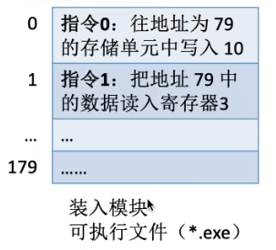

绝对装入， 要求程序的指明的地址，所对应的内存空间要可用，使用与早期 的单道操作系统。 因为内存里只能有一个程序，不然的话有第二个程序，就得用到相对了。


相对装入，程序里面指明的地址是相对于程序头地址的。内部地址的偏移是通过 **基址寄存器BR** 实现的。


#### 装入的三种策略

绝对装入

1. 只适用于单道系统
2. 要提前知道变量存入的内存空间的地址

静态重定位

1. 程序里面使用的地址 是在第一次装入的时候确定的，即"重定位"
2. 内存空间是连成一片的。不能分开。没有足够的内存就不能装入。
   

动态重定位

1. 程序把装入模块装入内存后，没有第一时间把逻辑地址映射成实际地址，而是 "真正要执行的时候才进行地址转换"
2. 需要重定位寄存器的配合
3. 运行程序在内存里面移动
4. 可以运用虚拟的技术把程序放到不连续的存储区
5. 运行前装入部分代码，根据需要动态申请
6. 可以向用户提供一个比实际存储空间大的多的空间


#### 从c代码到可执行文件


#### 链接的三种方式

1. 静态链接  // 先链接好在装入内存
2. 装入时动态链接  // 边装入边链接
3. 运行时动态链接  // 只有要 **调用该模块** 的时候才 链接
   


### 内存的管理与回收

操作系统需要实现对内存的  保护(程序分解), 拓展(虚拟), 分配与回收, 地址转换


#### 基本概念

- 操作系统负责内存的管理与回收
  内存管理与回收在探讨些什么？

1. 进程应该放在内存哪里？
2. 怎么判断内存某个位置是空的还是已经分配出去了
3. 程序运行结束以后，怎么回收其内存空间


- 操作系统利用虚拟技术来从逻辑上拓充内存
- 操作系统要实现 逻辑地址到实际地址的转换，这个过程叫 "地址重定位"

实现地址转换有三种方式：
绝对装入 // 这个时期，暂时还没有操作系统，他的定位是由编译器进行的
可重定位装入 // 装入之前才确定地址，但是内存连续，用于早期多道批处理系统
动态重定位装入 // 执行到某个模块才装入，程序可移动

#### 内存保护

操作系统有 保护内存的机制， 就是说 程序A不能访问 程序B的 内存空间

如何给程序划定边界？
方法一： 使用上限寄存器，下限寄存器来划定程序的边界
方法二： 采用重定位寄存器（基址寄存器），界地址寄存器（限长寄存器） 进行越界检查


方法一是直接给出上限下限，方法二是给出基址和加值的最大值

### 覆盖与交换技术


覆该技术的应用场景： 早起程序大小比内存还大的时期。 IBM 最早推出的内存才1MB大小


**固定区不会调入调出，覆盖区可能会调入调出**
一个程序如果有明确的调用结构，就可以把同层级的调用给"覆盖"，选取同层级中最大的模块，作为覆盖区域的大小

交换技术：
内存空间紧张的时候，把某些程序先调出内存，暂时放到外存里面。 在把一些已具备运行条件的程序换入内存。

**PCB常驻内存** 因为进程的运行情况啊，包括放到外存哪个位置都是需要记录追踪的，这个PCB就是载体

交换技术就是中级调度


高级调度： 操作系统从外存的就绪队列里面选择一个进程放入内存
**中级调度**:  把暂时不活跃的进程，调入外存的挂起队列。 应用了虚拟的技术
低级调度： 从内存的就绪队列选一个进程上处理机

挂起的七状态模型


#### 交换技术

内存紧张的时候，把一些进程调出内存，这就用到了交换技术

1. 在外存的哪个位置保存被换出的进程？对换区，因为可能他会经常被调入调出，所以存放在IO比较高效的对换区。
2. 什么时候交换？一般内存吃紧的时候就会发生交换。为什么操作系统知道内存吃紧？ 缺页故障高频发生的时候就吃紧了。
3. 换出那些进程？
   换出阻塞的进程，换出优先级低的进程。

**PCB常驻内存别忘了。**


### 内存分配

内存分配有连续和离散的方式。

**连续分配就是为进程分配的内存空间必须是连续的**

#### 连续分配管理

##### 单一连续分配

特征：

1. 系统分为用户区和系统区，系统区在低地址处
2. 用户区被单道程序独占
3. 可采用覆盖技术扩充内存

优缺：

1. 实现简单
2. 无外部碎片(但会有内部碎片)
3. 不一定需要采取内存保护

外部碎片就是不能分配给进程使用的内存空间。 内部碎片就是分配给了进程，但是没有使用上的空间。


##### 固定分区分配

特征：

1. 系统分为用户区和系统区，用户区被划分为多个固定大小的分区，每个分区只能装入一道作业

优缺：

1. 没有外部碎片
2. 实现简单
3. 用户程序太大的时候，可能所有分区都无法满足需求，不得不采用覆盖技术。
4. 会产生内部碎片

###### 分区大小相等

1. 适用于多道一模一样的作业的场景 (比如工厂的流水线)
2. 缺乏灵活性

###### 分区大小不同

1. 灵活性增加
2. 小分区多，中分区中等，大分区少


**操作系统如何识别分区?**

**通过分区说明表，这是一个数据结构，每一个数据项涵盖了： 分区号、大小、起始地址、状态等信息**


##### 动态分区分配 (可变分区分配)

在进程**装入内存**的时候，根据进程的大小动态的建立分区。


特点:

1. 会产生外部碎片

**使用什么样的数据结构来记录内存的使用情况？**
**很多分区都满足的时候怎么选择分区？**

**空闲分区表**


**空闲分区链**
使用双向链表，指针域指向下一个分区所在的趋于。 分区的起始部分要记录分区大小信息等等。


如何进行分区的分配和回收？使用空闲分区表：  直接修改表项目就行了。

1. 新进程分配空间： 把分区大小修改，起始位置修改
   
2. 新进程分配空间且刚好占据一个空闲分区:  删除表项
   
3. 回收一个进程后，空闲分区连起来： 修改表项
   
4. 回收一个进程后，三个空闲分区连起来:  修改表项, 删除一个表项目
   
5. 本来沾满的分区，回收以后多了一个空闲分区：  增加表项
   **表项的排序是和动态分区分配的算法有关的，所以新增表项的插入位置不一定。**
   

通过紧凑技术来 移动分区， 从而使得外部碎片合并成一个可用大小的空闲分区。


**什么是紧凑技术？**
就是通过移动程序把内存的外部碎片合并的一种技术。他的执行过程：

1. 确认空闲空间位置
2. 对移动的目标趋于和当前区域上锁
3. 复制和移动程序  // 根据chatGPT的说法，不需要进行中级调度，把程序主体换出内存在换入（因为涉及到IO操作肯定会变慢） chatGPT说是直接复制的。
4. 重新计算 pointers 和 references 的位置。//  对于可浮动程序，利用基址寄存器，程序内部的指针都是基于基址寄存区运算的，所以复制完成后他们不需要重新计算。 但是系统里面指向这个程序的东西都要重新计算。 比如说空闲分区表或者别的东西。
5. 释放没被用的内存。

低级调度(进程调度)： 从就绪队列选一个上处理机。 中级调度(内存调度)： 内存里的进程由于内存空间紧张换出外存。 高级调度(作业调度): 从外存的后备队列选一个进程装入内存。


##### 动态分区分配算法

动态分区分配算法就是 动态分区分配中，如何选择一个分区分给 要装入内存的 进程的算法。

分为： 首次适应算法、最佳适应算法、最坏适应算法、邻近适应算法

###### 首次适应算法 (First Fit)

思想:  把空闲分区**按 首地址 从小到大排列**，然后每次匹配从头开始，找到大小满足的第一个分区。


空闲分区的顺序是： 首地址从低到高

###### 最佳适应算法 (Best Fit)

思想:  把空闲分区**按 大小 从小到大排列**，然后每次匹配从头开始，找到大小满足的第一个分区。


空闲分区的顺序是： 空间大小从低到高
缺点： 因为每次都是从最小的空闲分区进行分配，所以最后会留下很多，非常小的无法利用的外部碎片。

###### 最坏适应算法 (Worst Fit、Largest Fit)

思想:  把空闲分区**按 大小 从大到小排列**，然后每次匹配从头开始，找到大小满足的第一个分区。


空闲分区的顺序是： 空间大小从 大 到 小

缺点： 内存里面大空间的空闲分区被迅速使用完，后续大进程到来就无法使用。

###### 邻近适应算法 (Next Fit)

思想:  为了减少查找可用分区的开销。 在最佳适应算法的基础上（修改为循环链表），每次查找不用重头开始，而是直接从**上次**查找的分区的开始。 匹配且分配以后，空闲分区不需要重新排序。因而操作步骤更少，部分操作性能更高。


优点： 不用从头查找，性能更高。
缺点： 和worst Fit 一样，大空间会被迅速用完，导致大进程无法使用。

**综合来看，首次适应算法是最佳的。。。**


### 分页存储管理

分页存储管理是非连续分配的一种，即进程在内存里面占用的是不连续的内存空间。

#### 基本概念


- 页框： 把内存空间划分为一个个大小相等的分区，叫页框 // 页框=页帧=内存块=物理块=物理页面
- 页： 把 **进程的逻辑地址空间** 划分成**和页框大小相等**的一个个部分，每个部分称为页 // 页=页面
- 页号： 页的编号e
  

**进程的页和页框有一一对应的关系**

- 页表:  保存页和页框(内存块)映射关系的表，存放在进程的PCB 里面， 一个进程一个页表、一个页面对应一个页表项。
- 页表项： 页表的一个具体记录，记录映射关系

**每个页表项占多少字节？？**
这个需要结合 `内存空间` 和 `页框大小` 来考虑。 因为内存空间大小/页框大小=页框数量， 页框数量又决定了 多少位二进制位才能满足所有页框的编号（大小）   
比如说: 内存空间4GB，页面大小4KB。 那就有 4GB/4KB = 2^20 个 ， 也就是说需要20个位，也就是3个字节 3B 来表示。   第i号的页表项地址是 X+3i (X是页表的`起始地址`)

如果该页表有0-n项， 那就需要 3(n+1)B的存储空间 

每一个进程有一个页表， 页号是可以隐含的，就是顺序表示，序号是不需要的。 从而，只需要保存块号（页对应的内存块号,页框号）


如何实现地址的转换？    

页面在内存里面是离散存放的，但是页面内部是连续存放的。   
所以对于逻辑地址A， 我们只需要找到他的`页号`从而求出对应页框的`起始地址`，还有`偏移量`就能确定他在内存里面的地址。

确定了页号， 就能确定起始地址。   

例子： 页面大小50B,逻辑地址空间200B，逻辑地址 110 的 页号和 页内偏移量 是多少？  

逻辑地址 110 ，注意这里是10进制的。  系统按字节寻址。 

110 / 50 = 2 ... 10 因此位于 页面 2 页内偏移量为 10

知道页号了，就去查询页表的第二个页表项，看到其对应的页框号，然后就知道起始地址了，起始地址+页内偏移量就行。


计算机 确定 页号和 页内偏移量 只需要 用到 逻辑位移 来截取 地址

页号 = 逻辑地址 / 页面长度  `整数部分`
页内偏移量 = 逻辑地址 % 页面长度  `余数部分`
- 页面长度： 一个页的单元数量


结论: 如果 页面大小为 2^k ，则其 偏移量为 `逻辑地址` 为后面的k位， 页号为前面的 n-k位  (注意是2^k个存储单元，你要看操作系统是按B寻址，还是4B寻址，单元数因此不同的。)

计算 页框起始地址 如何 确定？  
假设某计算机，用32个二进制位表示地址，页面大小为4KB=2^12B=4096B。 

32 - 12 = 20 // (2^12=4096)  
前 20 位 是页号， 后面是页内偏移量  
因此：    
0号块 起始地址 0000 0000 0000 0000 *0000* `0000 0000 0000`   
1号块 起始地址 0000 0000 0000 0000 *0001* `0000 0000 0000`    

注意如果 页面大小不是2的整数幂，那么这个方法就不适用。  


#### 基本地址变换机构

地址变换机构就是把进程的逻辑地址变换为真实的内存的物理地址，从而方便寻址的机构。  

页表寄存器（page table register, `PTR`） // 进程PCB 里面有他的 页表 对应的 `起始地址` 和 `页表长度` ，当进程 被调度的时候 操作系统 会把他们放到页表寄存器里面   
`注意是页表长度`，不是页面长度


1.  操作系统对进程 进行调度的时候，把 进程PCB里面保存的页表的信息放到 页表寄存器里面， 包括 起始地址F 和 页表长度M

2.  程序计数器 PC 指明了下一个逻辑地址A 
3.  A 来到基本变换机构， 首先 根据逻辑地址计算出 页号和 偏移量。  页框数量 = 地址空间 / 页面大小  得知 位数 n 以后 逻辑地址的 后n 位 就是 页内偏移量， 其余是 页块号    
页号会在 变换机构里面转为 起始地址， 偏移量不变
4. 页表长度M 和 页号 比较，如果页号 ≥  M，  说明 超出范围， 唤起越界异常 内中断
5. 如果 通过的话 ，就 利用 `页号 * 页表长度 + 起始地址` 来求得 对应的页表项， 从而得知 `目标页框的起始地址(内存块号)`   在把 页内偏移量 加起来 得到 结果。
6. 访存

已知： 页面大小L、逻辑地址A、求物理地址E

页号 = A/L ， 通过页号找到 对应的内存块的起始地址 F    
`注意比较页号是否超出范围`   
页内偏移量  =  A%L  ， F + A%L 就是 物理地址 E


逻辑地址是一维的，就是说只需要提供一个信息。 只要给了这个信息，系统就自动算出页号、偏移量，并不需要显式的拆分成两部分给出。

页表项长度 和 页面大小的 关系: 

**实际应用中，页表在内存里面一般是连续存放的。**   
页表项长度最好是设计成刚好和  页面大小是倍数的关系，即 页表项长度是 2 的整数次幂。

这样页表就不会有内部碎片。

反例： 假设物理内存大小4GB, 页面大小4KB。 页面数量就是 2^20 个。  需要3B才能存储一个 页号。 如果 页表项设计成 3B 的话，结果就是 4KB/3B = xx.. 1B ，有内部碎片。  为了方便 页表的查询，页面设计成 刚好装得下整数个页面。


#### 具有快表(TLB)的映射机构

TLB(translation lookaside buffer)，是用 SRAM(比DRAM，也就是内存快了100倍) 来保存 页表以提高 逻辑地址查询效率的一个 机构。其能够提高效率 是因为 程序具有 `空间局部性` 和 `时间局部性` 

内存里面的页表，通常叫做慢表。  

device hierarcy   


Cache 是 SRAM组成的。   
速度越快造假越贵，存储空间越小。

具有快表的映射机构的工作流程


1.  逻辑地址A 放入 PTR, (page table register)。  然后 拆分成页号和 页内偏移量
2.  先 检查 页号 有否超出范围。 如果没有继续
3.  到达快表检查是 是否命中， 命中的话直接 把 页号对应的内存块 转为其 页框的起始地址 然后和 页内偏移量拼接 得到 真实的物理地址; 未命中的话 根据页表的起始地址  M + 页号P * 页表项长度 得到 对应的 内存块号所在的地址。 然后 + 偏移量得到真实的地址。

**快表的访问速度是慢表的100倍**

**一般来讲，快表的命中率有90%**

**未命中算的时候需要两次访存： 1. 查询页表, 找到以后要把该页表项存入快表（如果满了利用页面置换算法计算更换哪一项） 2. 访问目标单元** 

访问快表 1us, 慢表 100us。快表命中率 90%。 问平均访问时间？    

快表、慢表分开查找:  

(1 + 100) * 90% + (1 + 100 + 100) * 10% =  111 us // 快表慢表分开 查找的时候的 平均访问时间。   
  
(1 + 100) * 90% + (100 + 100) * 10% =  110.9 us // 快表慢表同时查找 查找的时候的 平均访问时间。   

(100+ 100) * 100% = 200us // 没有快表的机构  

利用甘特图（gantt chart） 表示的 快表慢表同时查找与分开查找的区别     

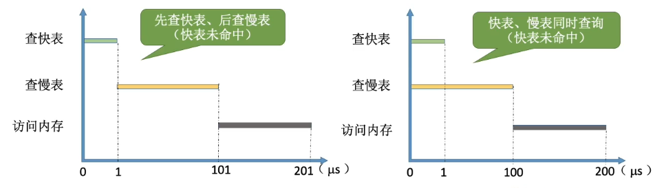

前者： 查慢表在 快表之后   
后者： 同时进行  

**什么是甘特图？**
甘特图是用来表明 事件 的起始时间、终止时间和其 依赖关系的 一种图表。   


**局部性原理**  


时间局部性： 短时间内频繁访问同一指令（循环结构的代码）    
空间局部性： 短时间内频繁访问连续存储的单元 


**TLB和普通的cache有什么区别？**   
两者都是SRAM，但是TLB只保存页表。 而 cache保存各种数据。


#### 两级页表

单机页表的缺陷： 完整的存放页表 1.需要大量的页框2.会频繁用到的页框很少，所以完成的放入内存浪费了内存空间。   

解决方案： 多级页表， 把长长的页表分组， 各组离散的存入内存，然后在为其建立 `页目录表`，来保存他们的位置信息。 


等级原地的页表数量越多。   

逻辑地址 32 位的内存空间，如果 页表大小是 4KB的话，就有 2^20 个项(1048576)。    
一个页表项 至少 3B 取 4B。    
如果 三级页表 建立 二级页表， 则其内容是 内存块号 ( 页号隐含 ) 指向的内存块里面存放着 三级页表。   
一个页表项占据4B，因此一个页框可以装 4KB/4B = 1024个页表项。 从而 三级页表以 1024个为一组装入内存对应一个二级页表项 (就是对应的内存块号) 
1024个二级项组成 一个 顶层页表(一级页表)。 

逻辑地址结构划分：   
低12位是一级页表的页内偏移量。     
中10位是二级页表的页号。   
高10位是目录页表的页号。     

地址变换过程:    
首先取高10位，看是否越界。   
没越界的话，高十位表示页号， 页号* 页表项长度 + 起始地址得到 对应的内存块号。   
访存，取出二级页表。
根据 中10位，得知页号，从而得知，一级页表所在的内存块。   
访存，取出三级页表(放入快表)。 或者是 根据 起始地址+ 页内偏移量  得到 目标地址。    

按字节编址。40位逻辑地址，页面大小4KB，页表项4B。需要采用几级页表，页内偏移量多少位？ 
页面大小4KB，按字节编址。  4KB/B = 4K 个存储单元，页内偏移量 12位。    
4KB/4B = 1K  一个页面有 1K个页表项。   
从而  40 - 12 - 10 - 10 - 8  = 0 需要三级页表:   
13-22 位 三级页表的页号   
23-32 位 二级页表的页号   
33-40 位 页目录表 （一级页表） 


访存过程：


### 分段存储管理

什么是分段存储？ 就是把程序的代码，按照程序段划分，然后按段存入内存的方式。

1. 每个段有自己的段名（汇编代码里面展示的是 段名, 到汇编结束以后转为机器码）    
2. 段内都是从0开始编址。
3. 段内连续
4. 段与段可以不连续
5. 由于是按照逻辑功能分段，用户变成更加方便，程序可读性更高


程序可读性是汇编层级的可读性变高了。 因为 [D]里面直接放的是段名。
[A]是单元


从C语言到代码需要经过： 预处理prepocessing、编译compilation、汇编assembly、链接linking。 


段的逻辑地址结构：  

段名被翻译成 段号。      
单元会被翻译成偏移量。    
逻辑地址由段号和段内偏移量组成。 段号的长度决定了内存里面最多有多少个段。 段内偏移量决定了一个段最多有多长。    
 


段表   
   
1. 段号隐含
2. 有基址和段长两个信息
3. 各个段表项的长度是一样的。

地址变换的过程：   

要执行的步骤： 取出段号为2，段内地址为 1024的 单元里面的内容放入寄存器1    

1. 从PCB 里面取出 段表的 信息 放入 段表寄存器 （包含段表的起始地址和段表长度）

2. 从逻辑地址里面取出段号， 与 `段表长度` 比较，看是否越界，越界就抛出异常（内中断）。 // 注意看是段表长度，不是段长    
3. 通过 段基址+段号*段表项长度  找到对应的段表项。   
4. 比较 段长度和 逻辑地址中的段内偏移量，如果越界就 抛出异常  
5. 没有越界的话， 通过 段基址 + 段内地址 就能找到对应的 存储单元

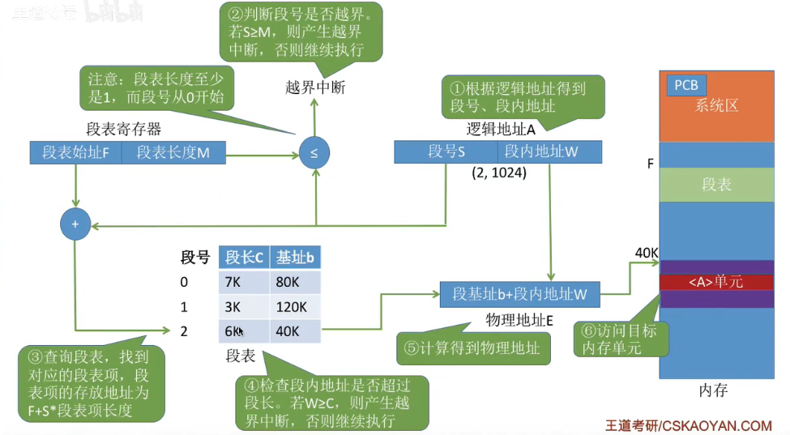

**分段和分页的对比** 
1. 页 是 信息的物理单位； 段是逻辑单位； 
2. 页对 用户不可见； 段可见；
3. 页的长度固定，由操作系统决定； 段长度不固定，由用户决定
4. 页的 用户进程地址空间是一维(用户只需要给一个记忆符就能表示一个地址)；段的 `用户进程地址空间` 是二维的（需要给出段名和段内地址） 
 


5. 分段比分页更容易实现 信息的共享和保护 

**不能被修改的代码被称为 *纯代码* 或者 *可重入代码* (不属于临界资源)**

准确的的来说不是指 不能被修改的代码， 而是在多线程中，不会造成不想要的效果的那部分代码。 VP操作外的代码。可重入代码 被设计的具有 线程安全性，和 可重入。 意思就是说他可以被并发的执行。(其实就是非临界区代码)

为什么说 分段更容易实现共享？ 因为不同进程非临界资源的代码，纯代码，可以共用一个段，不同进程 映射到同一个段 就能简单实现共享


为什么 分段更容易实现保护？ 因为相比分页，分段的是按逻辑分开代码块的，按逻辑区分该部分代码能不能共享更加简单，从而更加安全。   

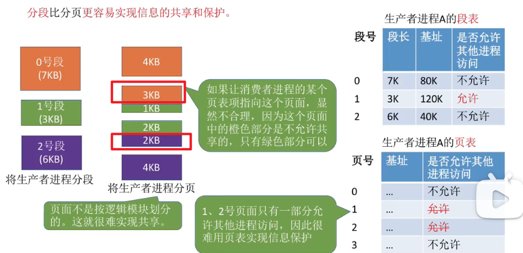


#### 段页式管理

分段、分页的优缺点： 


分段管理产生的外部碎片可以用紧凑技术解决。但是紧凑技术非常消耗性能。   

段页式管理：先按逻辑分段，再分页 


段页式管理的逻辑地址结构

段号是高位，页号是中位，页内偏移量是低位。

段号决定了最多有多少个段，页号决定了一个段最多分为多少个页，页内偏移量决定了一个页有多少个存储单元。   


由于分页这个行为是系统进行的，对用户不可见，用户只需要提供 段号标识 和 段内单元的地址 ， 所以说段页式的逻辑地址是**二维**的。

段页式管理的段表和页表：   

一个进程对应一个段表。 一个段对应多个页表。  因此一个进程可能对应多个页表。  

段表： 段号(隐含)，段基址，段长度 // 段式管理里面的段表  

段表： 段号(隐含)，页表内存块号，页表长度。页表是连续的页框存储的。 // 段式管理里面的段表  
页表： 页号(隐含)，页内偏移量，页不是连续存储的。


逻辑地址变换流程（段页式管理的地址映射机构工作流程）:  

1. 从PCB里面取出 段表的信息放入 段表寄存器 （段表基址 + 段表长度）
2. 比较段号和段表长度， 如果越界，唤起异常（内中断）
3. 如果无异常，找到对应段表项
4. 比较页号和 页表长度。 如果越界唤起异常。 
5. 找到其页表。根据页号得出页所在的内存块号。
6. 根据内存块号得到页基址+页内偏移量得到 物理地址。


### 虚拟内存基本概念

虚拟存储技术是 用于 **扩充内存的** 一种技术。 覆盖和交换技术比较旧。

传统管理方式，及其缺点：    

缺点：   
一次性：必须一次性的把作业全部装入内存才能开始运行。 这会导致：如果作业过大的话，无法装入内存就无法运行。 作业过大的时候内存里装入的作业数减少，导致并发度下降。    
驻留性：一旦装入内存就会一直保留在内存里面，直到运行结束。 实际上运行的只是一小部分的代码，所以浪费了大量的空间，导致性能降低。   

为什么可以使用虚拟技术来扩充内存？  局部性原理

为什么需要使用虚拟技术来扩充内存？  性能金字塔, 内存的造价还是比较高的，为了充分利用内存所以需要虚拟技术。

虚拟技术干了什么？ 当作业需要某个信息的时候，操作系统才把他调入内存，当内存空间不够的时候，把闲置的空间换出内存(置换算法)。

调入内存需要 提供的系统调用：  请求调页，请求调段。

虚拟技术的特征：   
1. 多次性， 作业不是一次性调入内存的，而是需要的时候多次调入内存。
2. 对唤性， 作业不需要常驻内存而是允许在作业的过程中换入换出。
3. 虚拟性， 从逻辑上扩充了内存的容量，使用户看到的内存容量远大于实际的容量。

如何实现虚拟技术？ 在分段、分页、段页式管理中加入请求时调页，调段的功能实现虚拟技术。  


### 请求分页管理

请求分页管理和基本分页管理的区别：   
前者是用到的页才调入内存，并且可以把暂时用不到的页换出内存。后者页是常驻内存的。  操作系统需要辅助实现请求调页的接口。

请求分页的页表(又叫做请求页表)

相比基本页表，新增了：   
1. 状态位，标记是否调入内存
2. 访问字段，记录访问次数， 用来结合替换算法使用
3. 修改位，是否修改，如果没修改的话，换出内存的时候，直接不用写回硬盘
4. 外存地址

请求调页需要提供的信息： 页在外存的位置，页是否调入了内存  
内存不足时页面置换： 访问次数，是否被修改过

缺页中断机构(如何实现请求调页)：  
1. 访问页面前，现在请求调页页表查看他的状态位，确定是否在内存里。
2. 不在内存里面的话，唤起 `缺页中断` 然后执行 `缺页中断处理程序` ，`此时该进程进入阻塞队列`，直到该页完成调入内存的工作，`该进程进入就绪队列`。
3. 如果内存有空闲块，就把页装入空闲块，`修改请求页表中该页的状态位`
4. 如果页没有空闲块，利用 `置换算法`，选择一个页面淘汰。被淘汰掉的页面 `如果被修改过`，就要被 `写回外存`。 没有修改过的页不用写回外存。

缺页中断在异常里面的分类：  故障（内中断）
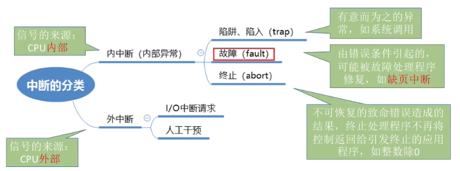
**一条指令可能产生俩次缺页中断， 比如 A copy to B ,A、B都不在内存里面**

请求分页要新增的步骤：   
1.  在查到页表项的时候，判断： 请求调页
2.  需要调页，单没有空闲块的时候：  页面置换
3.  需要修改请求页表里面新增的表项

请求分页的地址变换机构： 


1. 首先从程序PCB中取出页表信息，放入页表寄存器（PTR），包含页表长度和页表基址。
2. 逻辑地址到达，先拆分为 页号和 页内偏移量。 
3. 比较页号是否越界，越界的话抛出 越界异常（内中断）
4. 在快表找对应的页表项，没有的话，去慢表查询
5. 如果没有越界，就 通过 页基址 + 页号 * 页表项长度 找到对应的页表项 。
6. 查看 对应页表项 的 状态位，看他装入内存没有。没有的话唤起 缺页异常（故障）。 然后通过 异常中断服务把对应的页调入内存。 如果内存已满要用置换算法换页出去。 
7. 从调入的页表里面 通过页内偏移量找到 物理地址。

细节： 
1. 只有"写指令"才需要修改"修改位"。 一般来说只需要修改 `快表` 的修改位，只有当 `快表项要删除` 的时候才需要写回内存的慢表。 这样可以减少访存的次数。
2. 和普通的中断一样要保留现场
3. 需要使用"页面置换算法"来决定换出的页面
4. 换入/换出 需要 IO操作，速度慢，所以不能 换入/换出频繁发生会降低性能
5. 页面调入内存之后，要修改慢表，同时也要把表项复制到快表


#### 页面置换算法

1. 最佳置换算法 (OPT) 
2. 先进先出置换算法 (FIFO)
3. 最近最久未使用算法 (LRU)
4. 时钟置换算法 (CLORK)
5. 改进型的时钟置换算法

需要考虑的点：算法思想，算法执行的流程，问题和缺陷，计算缺页中断和页面置换的次数。

##### 最佳置换算法  Optimal
思想： 在 `未来` 最长时间不被访问的页面淘汰。未来指的是 在当前工作集 之后的  序列 里面 找当前 `工作集` 中的页面， 在未来 `最后才会被访问的那个` 页面淘汰。


置换(置换涵盖一次缺页)   
所以置换6次，缺页3+6=9次
缺页率 9/20 = 45%

缺点：  必须要预知未来来到的页面序列，由于操作系统无法预知，所以 `最佳置换算法` 无法实现   
无法实现，不知道讲个der..

**所谓工作集就是， 当前内存中的页面**
##### 先进先出置换算法 First In First Ont
思想： 先进先出。 使用一个队列来保存当前的工作集，按先进先出的原则进行淘汰  
   
缺页9次，置换6次，缺页率 45%  

**工作集长度发生变化的时候可能出现缺页反而增加的悖论**。   
当为进程分配的物理块数量增大的时候，缺页次数不减反增的现象-**Balady异常**

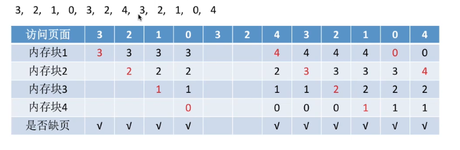
缺页10次，置换6次，缺页率 55%  

缺点： 只有FIFO会产生Balady异常。而且 运行规律和实际不符。往往先进入的都是最常用的页。

##### 最近最久未使用算法 Least Recently Used
思想： 把最进最久没有使用的页面淘汰掉。就是在发生置换的时候，依据当前工作集，逆向查找最后一个出现的页面。
  
实际是使用 页面的 访问位 来实现的， 每当一个页面被访问了，他的这个 位就置为0。 没有被访问到的位+1。 当置换发生就选出 访问位最大的那个 淘汰。

优点：性能好，最接近最佳置换算法     
缺点：需要专门的硬件来实现，实现困难，开销大。    
##### 时钟置换算法 Clock
思想：把工作集中的页面组成一个循环队列。 指针转圈扫描。当扫过的页面 访问位为1的时候置0。 当扫过的页面 访问位为0 的时候淘汰，并且把新页面置入该位，访问位置为1。 如果在工作集里面的 页面被访问，其访问位置为1。

**CLOCK算法又叫，最近未用算法(NRU,Not Recently Used)，性能和开销较为均衡的算法**   

其实就是不停扫描，如果你这个页面最近一直都没被用就换出去了。  

一开始 所有页面装入。   
  
扫描了一圈没有为0的页面。

继续扫描发现1号页为0

淘汰，6号页上来
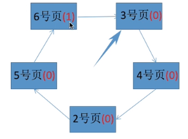

##### 改进型的时钟置换算法
思想： 在clock算法的基础上，加上对是否 `修改了页面` 的考量。 首先把页面 组成循环队列。 然后进行扫描。 检查 (访问位，脏位)。   

规则：   
第一轮扫描，如果为 (0，0) 近期没访问，且没修改的页面淘汰。   
第二轮扫描，选择（0，1）近期没访问，但修改了的页面淘汰。 扫描过的页面，访问位设置为0     
第三轮扫描，选择 (0，0) 淘汰。   
第四轮扫描，如果前三轮失败，那么就进行第四轮， 选择一个 （0，1）的页面淘汰。   

场景一：    

扫描到 (0， 0) 淘汰   

场景二： 
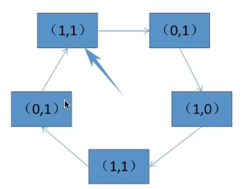
第一轮扫描： 无事发生
第二轮扫描： 选择 二号页面 (0, 1) 淘汰

场景三：   

第一轮扫描： 无事发生
第二轮扫描： 无事发生，但把页面的 访问位都修改为0 
第三轮扫描： 选择 二号页面 (0, 0) 淘汰

场景四：   

假设五个页面都是（1，1）那么 ：    
第一轮扫描： 无事发生    
第二轮扫描： 无事发生，但把所有的页面改成了 (0, 1)   
第三轮扫描:  无视发生    
第四轮扫描： 扫描到的第一个 （0, 1）淘汰


### 页面分配、抖动、工作集


#### 驻留集

就是操作系统给进程分配的物理内存块。   
1. 在应用虚拟技术的系统,驻留集大小一般比进程小
2. 驻留集太小，就需要频繁切换。驻留集太大的话，多道程序并发度降低。
##### 固定分配
操作系统分配给进程的驻留集数目在运行期间不会改变。
##### 可变分配
操作系统根据进程的运行情况调整驻留集的数目，可增可减。
##### 局部置换
缺页的时候只能选择自己的物理块置换。
##### 全局置换
缺页的时候， 可以使用操作系统保留的物理块;也可能是别的进程的物理块置换到外存，然后分配给该进程
##### 分配策略和置换组合


固定分配意思就是在自己的物理块里面置换。全局分配肯定要用到自己的驻留集外的物理块，扩充驻留集，这俩逻辑上是相悖的。所以没有这种搭配。

##### 固定分配局部置换
分配的物理块数量不变，发生置换的时候只能换出一个页到外存，然后调入需要的页面。  
特点：   
1. 难以在开始前确定分配多少物理块合适。
2. 根据 进程 `大小`、`优先级`、 `程序员指定` 来决定物理块

##### 可变分配全局置换
物理块数量可变，发生缺页，系统会选别的进程中 `未锁定` 的页面 换到外存，在分配给该进程。  
特点：   
1. 当前进程的驻留集可能会变大。
2. 被剥夺物理块的进程 缺页率可能增大。

##### 可变分配局部置换
物理块数量可变，发生缺页， 只能从自己的物理块里面置换。 但是如果系统检测到一个进程的缺页率很高，系统就为其分配 物理块。反之如果缺页率很低，就可以适当减少物理块。


#### 何时调页？ 
##### 预调页策略 

依据局部性原理，一个页面调入以后与他相邻的页面可能会被使用，因此提前调入。目前预测成功率只有50% 不常用。    

一般用于 `进程的首次调入` ，由程序员指定 调入哪些部分。

##### 请求调页
就是当缺页发生以后，引发缺页中断， 由中断服务转接，去 外存找想要的页面，然后阻塞当前进程，直到当前进程 请求的 IO操作已完成，操作系统把他放入就绪队列，等待被调度。 IO开销比较大。

#### 何处调页？ 

外存有个对换区，对换区 读写速度更快，且连续分配。 

对换区空间够用的时候，对换发生在对换区。


对换区空间不够，且页面不会被修改的时候，直接从文件区调页。


对换区空间够，且页面被修改的时候，写回对换区，且在从对换区调入。


UNIX 方式：  调入从文件区，写回和再调入从对换区


#### 抖动现象
就是要频繁访问的页面，一直被调入内存又调出。 这个现象会发生的主要原因是： `驻留集的大小小于频繁访问的页面的大小`

##### 工作集、驻留集、窗口尺寸

工作集就是 最近访问的页面的集合   
窗口尺寸就是 工作集中页面数量的最大值    
驻留集就是 操作系统为进程分配的物理块   

比如说：   

```c++
page seq：  24, 15, 18, 23, 24, 17, 18, 24, 18, 17, 17, 15

Slide the Window by 1 page:

Initial Window (first 4 pages visited): 24, 15, 18, 23

Working Set: {24, 15, 18, 23}
Slide the Window by 1 page:

New Page: 24 (repeated)
Updated Window: 15, 18, 23, 24
Working Set: {15, 18, 23, 24}
Slide the Window by 1 page:

New Page: 17
Updated Window: 18, 23, 24, 17
Working Set: {18, 23, 24, 17}
New Page: 18 (repeated)
Updated Window: 23, 24, 17, 18
Working Set: {23, 24, 17, 18}
Slide the Window by 1 page:

New Page: 24 (repeated)
Updated Window: 24, 17, 18, 24
Working Set: {24, 17, 18}
```

为什么要有窗口 尺寸？ 因为 操作系统必须要有 范围来 评估工作集，超过这个范围就不管了。 不然你的工作集难道 无限大把整个进程放进去吗？ 有了这个尺寸 操作系统就会在 这个范围内检测工作集。     
比如说窗口尺寸是 5 ， 他的工作集大小一值在 3 左右。 那么系统会减小驻留集的尺寸为 3。 

比如说窗口尺寸是 5 ， 他的工作集大小一值在 4 左右。 驻留集尺寸为3。频繁缺页， 所以系统分配 一个新的物理块给他用。


### 内存映射文件 （Memory-Mapped Files）

这是一个操作系统给程序员提供的 `系统调用`。 
方便： 程序员访问文件数据，多进程共享一个文件。   

#### 传统文件方式


1. 只能一段一段的访问文件，不能随机访问。（因为他没有全部载入到内存里面）
2. 访问完了一段以后，必须指明下一段在哪
3. 传统方式的 IO操作更低效 ，因为必须是 程序员指明的，不是自动进行的。

#### 内存映射方式


在 `逻辑上`，文件是一次性读入，且连续存放。 程序员不需要关注复杂的调页问题，由操作系统自动管理与外存的文件映射。    

逻辑上的二号块如果没有读入，操作系统会自动调页，调入内存，使得逻辑上他在内存里且连续。  
进程关闭的时候，操作系统会把文件修改过的数据写回。

#### 内存映射方式 实现 共享文件

`逻辑地址空间` 就是对于程序员来讲，看到的东西。   
逻辑上的东西，可以不同，但是只要他们映射到同一个 页面，那么实际上就是相同的从而实现共享。 


其实系统的 `剪贴板` 就是一个典型的共享区域啊。

## 文件

操作系统需要提供文件管理的功能：   


文件需要有哪些属性，文件内部数据怎么组织，文件之间怎么组织   
OS需要提供哪些功能来方便用户使用文件？  
文件应该怎么放到外存里面？  
### 文件基本框架

#### 文件属性

1. 文件名： 同名目录下不能有重名文件
2. 标识符： 系统隐含的区分每个文件的id，用户不可见
3. 类型
4. 位置： 逻辑上的地址，外存实际的物理地址用户不可见
5. 大小 
6. 创建时间、上次修改时间、文件所有者 
7. 保护信息


#### 文件内部数据如何组织
##### 无结构文件（流式文件）
由二进制或者字符流组成，如文本文件


##### 有结构文件（记录式文件）
由一条一条想似的记录组成，如数据库表


#### 文件之间怎么组织
使用目录，`目录其实是一种有结构文件`


#### 操作系统应该提供那些功能

图形化界面使用的新建、删除等等，就是使用了操作系统的系统调用。  


open是读写的必要先决操作。  
基本操作组成别的操作，例如： 复制   
复制：  
1. create 一个新文件
2. open 源文件 read 到内存
3. write 到新文件 
4. close 源文件 close 新文件

#### 文件在外存如何存放（物理结构）

首先磁盘也会分块，如果一个文件很小只有10B，他也是要占用一个块的。
存放，管理文件块，空闲块如何管理，就是要思考的问题


#### 其他要实现的功能
保护、共享

### 文件的逻辑结构  
就是 逻辑上 文件是怎么 组织的。 分为 无结构文件，有结构文件。
 

#### 无结构文件
#### 有结构文件
##### 定长记录 
这种记录可以随机访问，因为每条记录长度是固定的。


##### 不定长记录
这种记录不能随机访问，因为每条记录长度不固定


#### 顺序文件
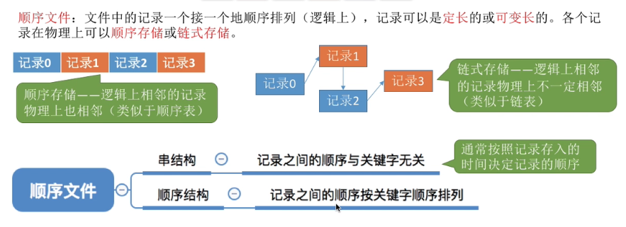

#### 能不能实现随机存取

只要是链式的存储方式就不能随机存取，不定长记录不能随机存取。   
不定长记录怎么保存？ 需要保存记录长度。


如果是串结构的顺序文件，无法通过关键字来快速定位，必须遍历。
定长记录，顺序结构，可以 `快速检索` 比如利用折半查找。

顺序结构和串结构的区分在于 `有没有按关键字排序`


顺序存储文件的缺点是： 插入删除一条记录比较消耗性能。 

##### 索引文件

为每个记录建立一个索引表，索引表本身是有序的。其指向的记录在内存里面是离散存放的。


1. 可随机存取
2. 需要额外的空间来存放索引表，mysql就有索引
3. 适用于对信息处理的及时性有要求的场景 

#### 索引顺序文件

索引文件，为每一个记录都建立了，表项，当记录很多的时候，会导致空间的浪费。 所以引入索引顺序文件。


其实就是把记录分组，然后建立上级表。但是上级表没有按关键字顺序排序，因此是一个串结构的定长记录的顺序文件。 因为串结构比较方便新增。

##### 索引顺序文件会降低效率吗？

不会，可以建立多级索引顺序表，每个表的长度控制，这样的话，就把查找次数控制在一定范围内了。

比如说: 一级表 100项，二级表100项，3级表100项。 
那平均查找次数就是 50+50+50，  缺可以容纳 100 * 100 * 100 个文件


### 文件目录


文件目录其实也是一个文件。  他是一个有结构，定长文件。 图形化界面在显示的时候，就是去找这个文件目录文件，渲染到桌面上。    


文件目录里面的一条记录就是 文件控制块 FCB (file control block)


FCB 的内容：    
1. 基本信息（`文件名`、`物理地址`、逻辑结构(文件还是目录)、物理结构）
2. 存取控制信息（可读、可写，禁止访问的用户）
3. 使用信息（创建时间，修改时间）

#### 基本操作与文件目录

搜索： 以文件名为关键字，查找文件目录的记录。
创建： 在文件目录中，新增记录
删除： 在文件目录中，删除记录
显示： 显示目录的内容
修改： 在文件目录中，修改对应的记录

#### 目录结构
##### 单级目录结构
系统里面只有一个目录文件，不允许重名文件。 重名必须修改，然后成功才在目录里面添加项目。

##### 两级目录结构
主文件目录是系统中用户，以及其 `相应的用户文件目录的位置`。   
二级目录，是用户各自的文件目录。  
允许不同用户的文件重名。

##### 树形目录结构
主文件目录是系统中用户，以及其 `相应的用户顶层文件目录的位置`。   
各用户文件目录之下，又可以有自己的目录。    
从根目录出发的路径叫绝对路径。   


设置当前目录，可以避免系统从根目录出发， `多次调取磁盘中的目录文件`，导致性能上的浪费。


**树形目录结构，不便于实现文件的共享，意思就是说A的文件难以共享给B**

##### 无环图目录结构
类似于 有向无环图 的结构。 因为不同用户的不同 FCB可以指向同一个文件或目录，所以 便于共享。   
但是需要设置计数器，当一个文件的所有者为0 的时候才能删除。


#### 索引结点
类似于 索引文件， 以文件名为关键字，提出来专门弄一个表，然后表项放一个指针指向具体内容，这样做可以缩小 索引文件的大小。  

**缩小索引文件的大小可以提高性能，为什么呢？ 因为如果索引文件缩小，他占用的磁盘块就少了，需要的IO操作就少了，从而提升了性能。**    


在外存里面的 索引节点叫 `磁盘索引节点`， 在内存的的叫 `内存索引节点`， 内存索引节点需要增加，是否被修改，几个进程在访问等信息。 


### 文件的物理结构

文件的物理结构就是他在磁盘里面是怎么存储和管理的。  文件的逻辑结构就是文件从 程序角度是怎么存储和管理的。


连续分配：磁盘块连续存储， 文件目录里面的物理地址只保存起始地址和块数。    
链接分配：磁盘块离散存储， 文件目录里面保存 起始的块地址，下一个块地址（显式链接）。块内指针指向下一块（隐式链接）  
索引分配：磁盘块离散存储， 专门用一张表来表示磁盘块的位置。   

#### 文件块、磁盘块


磁盘把 `存储空间` 化为了 一个又一个的物理块 **磁盘块**

文件把 内容 划分为了 一个又一个的 **逻辑块** ， 其地址是 `（逻辑块号，块内地址）`


一个逻辑块会存储在一个物理块里面。

#### 连续分配

在磁盘里面，其物理块连续存放。  


在文件目录里面 记录： 起始块号， 块数 来管理。


寻址过程：    
先到 FCB 找到 起始地址， 然后 可以 直接计算出 要访问的逻辑的 对应的物理地址。   `物理块号=起始块号+逻辑块号`   支持 `随机访问`  需要检测 逻辑块号是否合法。

优缺点：   

特点是磁盘读取效率，物理上是连续的，因此读取整个文件花费的，寻道时间，延时时间少，而且支持随机访问。    


但是增加内容的时候要移动和复制，效率低。 会产生内部碎片。


#### 链接分配

根据链接的构成方式不同分为 显式链接、隐式链接。

##### 隐式链接
隐式链接就是在磁盘块的内部，增加一个域指向下一个磁盘块。 检索的时候需要经过每个磁盘块才能访问下一个磁盘块所以它不能实现随机存储这点和链表是一样的不能随机访问。他进行增删操作更为的方便，效率更高。


